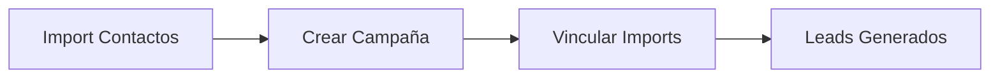
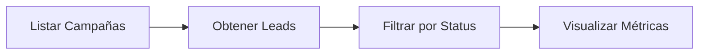

# Casos de Uso

Esta guía presenta los flujos de trabajo más comunes para integrar tu CRM o sistema externo con la plataforma SDR Agent.

## 🎯 Caso de Uso 1: Importación Manual de Contactos

**Escenario:** Tienes una lista de contactos en CSV/JSON y quieres subirla a la plataforma para organizarla en una cohorte.

### Flujo de Trabajo


### Pasos

1. **Crear el import cohort**
   ```bash
   POST /imports/
   ```
   Guarda el `import_id` retornado.

2. **Subir contactos en bulk**
   ```bash
   POST /contacts/bulk
   Header: X-Import-ID: {import_id}
   ```
   Envía CSV o JSON array con tus contactos.

3. **Actualizar el import**
   ```bash
   PUT /imports/{import_id}
   Body: { "status": "completed", "total_rows": 500 }
   ```

### Resultado
- 500 contactos organizados en una cohorte
- Listos para ser consultados o vinculados a campañas

---

## 🚀 Caso de Uso 2: Crear Campaña y Generar Leads

**Escenario:** Ya tienes contactos importados y quieres lanzar una campaña de outbound para generar leads.

### Flujo de Trabajo



### Pasos

1. **Importar contactos** (ver Caso de Uso 1)

2. **Crear campaña**
   ```bash
   POST /campaigns/
   ```
   Incluye:
   - Horarios de disponibilidad
   - Lead magnet (opcional)
   - Provider accounts (LinkedIn, email)

3. **Vincular imports a la campaña**
   ```bash
   POST /campaign-imports/{campaign_id}/imports
   Body: { "import_ids": ["import_id_1", "import_id_2"] }
   ```
   Esto crea automáticamente los leads.

4. **Consultar leads generados**
   ```bash
   GET /campaign-leads/?campaign_id={campaign_id}&status=pending
   ```

### Resultado
- Campaña activa con 408 leads
- Leads filtrados y sin duplicados
- Sistema de enrichment activado

---

## 🔄 Caso de Uso 3: Sincronización Bidireccional con CRM

**Escenario:** Sincronizar contactos entre tu CRM (Salesforce, HubSpot) y SDR Agent en tiempo real.

### Flujo de Trabajo

```mermaid
graph TB
    A[CRM] -->|Webhook| B[Crear/Actualizar Contacto]
    B --> C{Existe?}
    C -->|No| D[POST /contacts/]
    C -->|Sí| E[PUT /contacts/{id}]
    D --> F[Guardar en CRM]
    E --> F
```

### Pasos

#### Importación Inicial
1. **Crear import**
   ```bash
   POST /imports/
   Body: { "source": "salesforce", "status": "processing" }
   ```

2. **Bulk upload**
   ```bash
   POST /contacts/bulk
   Header: X-Import-ID: {import_id}
   ```

#### Sincronización Continua
3. **Webhook desde CRM → Crear/Actualizar**
   ```bash
   POST /contacts/  # Nuevo contacto
   PUT /contacts/{id}  # Actualización
   ```

4. **Consultar cambios**
   ```bash
   GET /contacts/?import_id={import_id}
   ```

### Resultado
- Base de datos sincronizada
- Contactos siempre actualizados
- Tracking por source (salesforce, hubspot, etc.)

---

## 📊 Caso de Uso 4: Dashboard de Métricas de Campaña

**Escenario:** Consultar el estado de leads y métricas de rendimiento de tus campañas activas.

### Flujo de Trabajo



### Pasos

1. **Listar campañas activas**
   ```bash
   GET /campaigns/?status=active
   ```

2. **Obtener leads por campaña**
   ```bash
   GET /campaign-leads/?campaign_id={campaign_id}
   ```

3. **Filtrar por estado**
   ```bash
   GET /campaign-leads/?campaign_id={campaign_id}&status=in_progress
   ```

4. **Obtener detalles de un lead**
   ```bash
   GET /campaign-leads/{lead_id}
   ```

### Resultado
- Vista completa de campañas activas
- Métricas de conversión por estado
- Leads en cada fase del funnel

---

## 🛠️ Caso de Uso 5: Gestión Individual de Contactos

**Escenario:** Operaciones CRUD sobre contactos específicos para correcciones o actualizaciones manuales.

### Operaciones Disponibles

#### Crear contacto único
```bash
POST /contacts/
Header: X-Import-ID: {import_id}
```

#### Consultar contacto
```bash
GET /contacts/{contact_id}
```

#### Actualizar información
```bash
PUT /contacts/{contact_id}
Body: { "locale": "es-ES", "timezone": "Europe/Madrid" }
```

#### Eliminar contacto
```bash
DELETE /contacts/{contact_id}
```

#### Listar todos los contactos
```bash
GET /contacts/
```

### Resultado
- Control granular sobre cada contacto
- Actualización de preferencias (locale, timezone)
- Enriquecimiento de metadata

---

## 📝 Notas Importantes

### Autenticación
Todos los endpoints requieren una de estas opciones:
- Header `X-API-Key: sk_live_xxx`
- Header `Authorization: Bearer {jwt_token}`

### Aislamiento por Organización
- Todos los datos están aislados por `org_id`
- Solo puedes acceder a tus propios recursos
- No necesitas especificar `org_id` en las peticiones

### Headers Críticos
- **`X-Import-ID`**: Obligatorio para vincular contactos a cohortes
- **`Content-Type: application/json`**: Para requests con body JSON

### Campos Automáticos
- **LinkedIn URLs**: Normalizados automáticamente
- **Companies**: Creadas automáticamente si no existen
- **Email**: Debe ser único por organización

---

## 🔗 Recursos Relacionados

- [Crear Contactos](/docs/contacts/create-contact)
- [Bulk Upload](/docs/contacts/bulk-upload)
- [Gestionar Campañas](/docs/campaigns/manage-campaigns)
- [Campaign Leads](/docs/campaign-leads/manage-campaign-leads)
